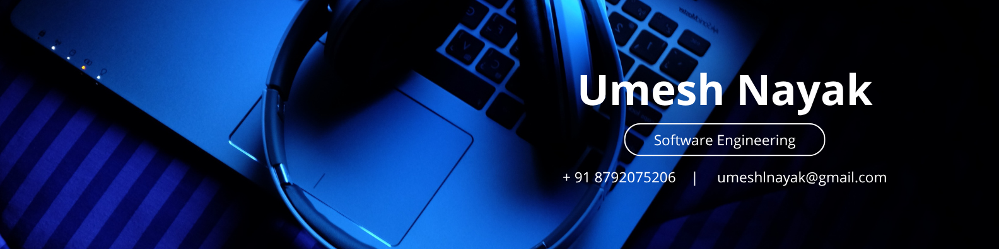

<!-- 🌟 Umesh Nayak | GitHub Profile README -->

<h1 align="center">
  Hi 👋, I'm Umesh Nayak
</h1>
<h3 align="center">Aspiring Software Engineer | Full-Stack Developer</h3>

 
   

- 👨‍💻 All of my projects are available at [Portfolio](https://umeshnayak1.github.io/my-portfolio/)  
- ⚡ Fun fact **I am funny😅**
  
<h3 align="left">Connect with me:</h3>

 

  

### 🛠️ Languages & Tools

  
  
  
  
  
  
  
  
  

 

📎 ***Explore more on my portfolio:*** [Portfolio](https://umeshnayak1.github.io/my-portfolio/)

<h3 align="center">
     
      Feel free to reach out — I love collaborating on innovative projects and discussing tech ideas 
    
</h3>

  

<h3 align="left">Support:</h3>

  

  
<h4 align="left">GitHub Stats:</h4>

  <!-- Main Stats -->
  
  
  <!-- Streak Stats -->
  

  <!-- Top Languages -->
   
  

💬 *“Great software isn’t just built — it’s carefully crafted, tested, and loved into existence.”*  
⭐ If you believe in building with passion, leave a ⭐!

